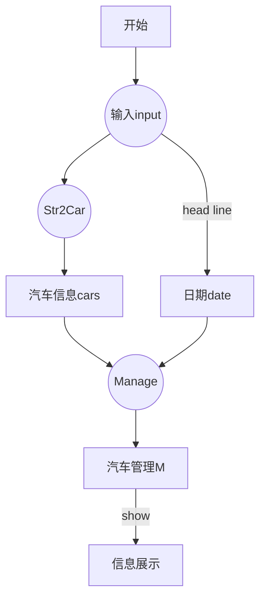

# **出租车保养及报废信息提示系统说明**
- **操作系统**：Linuxmint 18.2 Cinnamon(基于ubuntu 16.04LTS)
- **编程环境**：python 3.5.2
- **开发工具**：Pycharm， vscode
--------------

 [TOC]

## **系统简介(time2buynewcar)**
> 本系统旨在帮助出租车公司解决车辆保养以及报废情况的统计与提醒问题,本系统分为功能实现部分和测试部分。本系统实现的功能：通过输入提醒日期和车辆信息，通过内部计算判断，将保养及报废情况输出

### 功能实现

- **/main/Str2Info.py** </br>
 主要实现将输入的车辆信息字符串转换为车辆信息的类，例如：‘CAR00001|2034/08/09|BYD|9800|F’——id|Date|brand|dis|fix(编号|购买日期|品牌|行驶距离|是否大修)。实现功能：对车辆信息进行分类（**reminder**），__**分类 = {0：即将报废 ， 1：距离保养 ， 2：定期保养 ， 3：正常或已报废}**__

- **/main/manager.py** </br>
 主要对车辆信息进行管理的类，对汽车信息列表进行更深一层处理，主要功能有：保养报废情况统计（**count**），保养报废情况整理(**sort**)，保养报废情况展(**show**)示等

 - **/main/buynewcar.py** </br>
 主程序，运行**buynewcar**，可以使用系统功能

### 测试部分
- **/test/CarTest.py** </br>
针对功能实现里Str2Car类进行测试，包括初始化（**__init__**）和提醒方法（**reminder**）测试

- **/test/ManageTest** </br>
主要针对Manage类进行功能测试，包括初始化（**__init__**），统计方法（**count**），整理方法（**sort**）等测试


## **系统运行说明**
### 使用Pycharm
> 1.使用pycharm打开该工程（**time2buynewcar**）

> 2.打开 **/main/buynewcar.py**

> 3.使用 **ctrl** + **shift** + **f10**运行该文件，或右键该文件选择 **Run buynewcar**

> 4.然后在pycharm的控制台中进行输入，如下：
```
SubmitDate: 2030/09/01
CAR0001|2025/04/05|Porsche|10000|F
CAR0002|2029/10/14|Porsche|9000|F
CAR0003|2026/08/17|Porsche|13000|F
CAR0004|2027/11/01|BYD|23000|T
CAR0005|2027/01/11|BYD|19500|F
CAR0006|2029/07/01|Audi|10001|T
CAR0007|2028/04/19|Ford|9800|F
CAR0008|2027/07/10|Ford|15000|T
CAR0009|2024/10/22|Ford|90300|F

```
> 5.输入完成后，回车（两次），输出如下：
```
Reminder
==================

* Time-related maintenance coming soon...
Audi: 1 (CAR0006)
Porsche: 1 (CAR0002)

* Distance-related maintenance coming soon...
BYD: 1 (CAR0005)
Ford: 1 (CAR0007)
Porsche: 1 (CAR0001)

* Write-off coming soon...
BYD: 1 (CAR0004)
Ford: 1 (CAR0009)
```
> 6.运行测试文件**/test/CarTest.py**和**/test/ManageTest.py**,使用 **ctrl** + **shift** + **f10** 或右键**Run**

> 7.样例运行截图
- SAMPLE 1
@import "sample1.png" {title="示例1"}
- SAMPLE 2
@import "sample2.png"


## **系统流程图**


##

## [**github地址**](https://github.com/legite/time2buynewcar "thoughtworks homework")